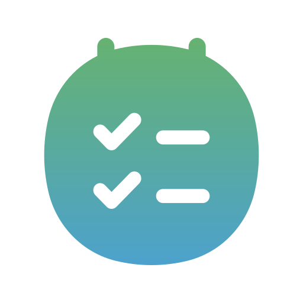

# DailyObjectives 
DailyObjectives is a Java Swing desktop app for managing daily goals.

## Screenshots 📷

## Features 📋

- Easy add and remove dates
- Add new goals for each dates
- Check goals just by clicking the X , you can also uncheck it if you made a mistake
- Automatically move past dates in the Old file

## Built With 🛠️

- <b>Java</b>
- <b>Java Swing</b>

## Getting Started

### Requirements

- <b>Java 24</b> or higher

### Run ▶️

Easily install the current release, at the first start the application will ask your desired folder to save the files.
If for any reason the program can't find the path (folder delete or path not present in config file for example) the program will
ask you again to chose your desired folder.

## Project Structure 📂

- <b>/src/Main<b>             → application Main file
- <b>/src/GUI<b>              → Swing interface
- <b>/src/ManagingFile<b>     → core program logic, read and write of the files

## About the GUI 🖥️

The application is written in Java using Java Swing.
The GUI was initially created with AI assistance while I was learning Swing, but the program logic is entirely my own.
I understand and actively modify the generated code, and I plan to refactor the UI in future updates.

## Roadmap 📈

- [x] Core logic implementation
- [x] Initial Swing interface
- [ ] GUI refactor
- [ ] More customization options

## License

This project is licensed under the MIT License.
